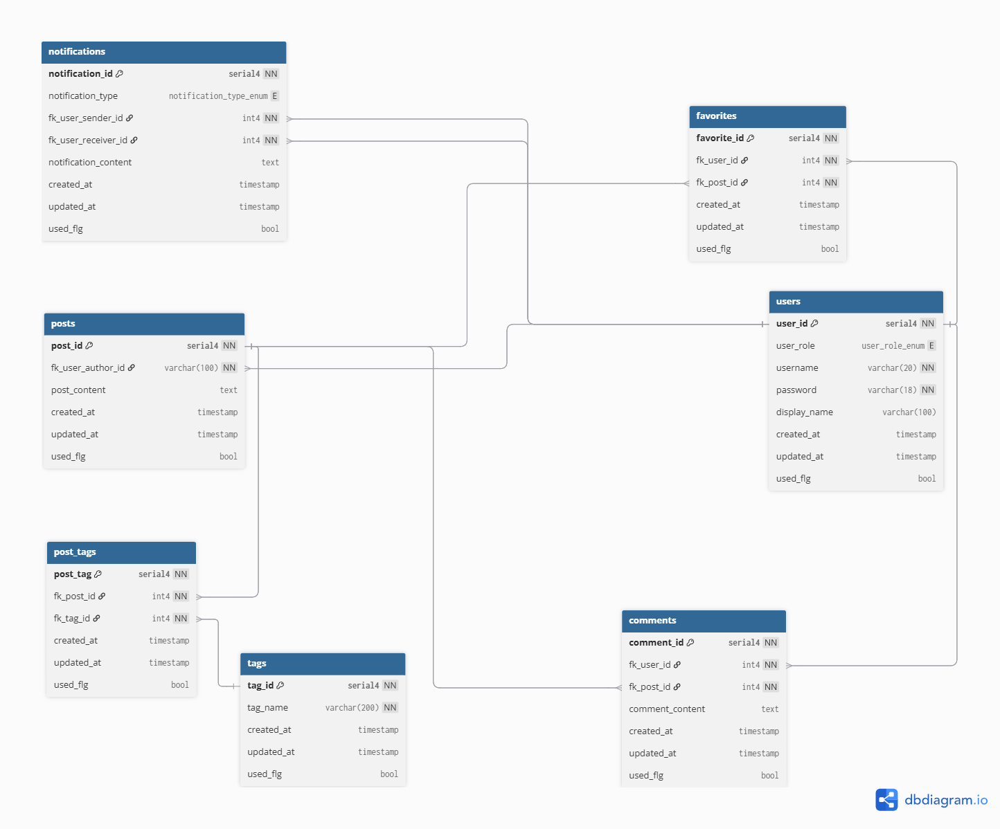

# Akineko

## Author

[Poom Yimyuean (lebrancconvas)](https://github.com/lebrancconvas)

## Overview

Animations, Comics, and Video Games Culture Webboard.

## Packages

- [frontend](https://github.com/lebrancconvas/Akineko/tree/master/frontend): Front-End of the project.
- [backend](https://github.com/lebrancconvas/Akineko/tree/master/backend): Back-End of the project.

## Project Setup

TBH...

## Software Design

### Project Requirement

You can view the Project Requirement at the file -> [REQUIREMENT.md](https://github.com/lebrancconvas/Akineko/blob/master/backend/docs/REQUIREMENT.md)

### Use Case Diagram

### ER Diagram

powered by [dbdiagram.io](https://dbdiagram.io/)

**ER Diagram**

**ER Diagram Code (dbdiagram)**

[Akineko's ER Diagram Code](https://github.com/lebrancconvas/Akineko/blob/master/backend/docs/code/Akineko-ER.dbdiagram)

## Tech Stack

### Programming Language

- TypeScript

### Front-End

- ReactJS

### Back-End

- ExpressJS

### Database

- PostgreSQL

### Version Control

- Git (Github)

### Containerization

- Docker

### CI / CD

- Netlify (Front-End)
- Render (Back-End)